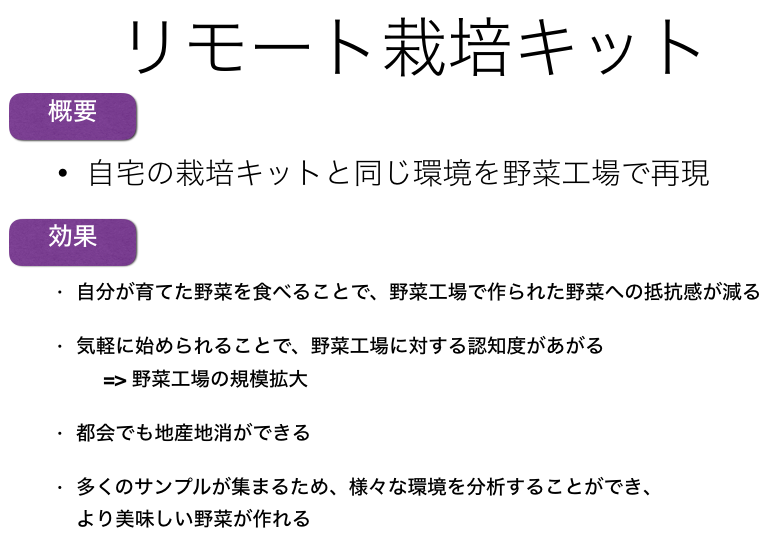
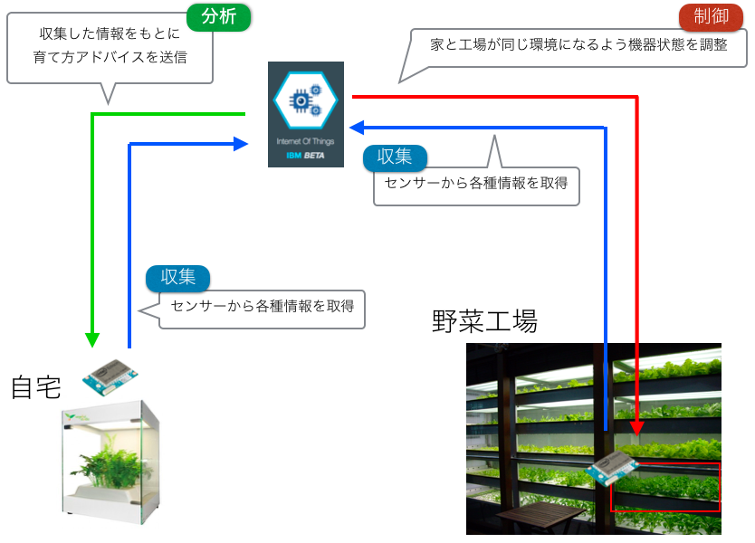

# Intel IoT Roadshow

## プロジェクト構成
* app.py
  - BluemixでたてたMQTTブローカーへきた情報をごにょごにょして、remote.pyへの指示を決める

* local.py
  - 自宅の栽培キットで取得したデータをMQTTブローカーへパブリッシュする

* remote.py
  - app.pyによって決められた野菜工場のLEDの増減指示をMQTTブローカーからサブスクライブする

# リモート栽培キット

## 課題

## 解決策

## 全体像

